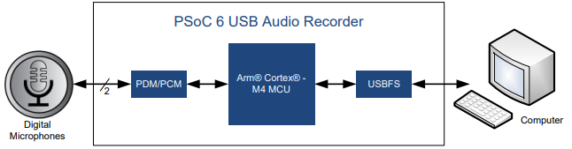
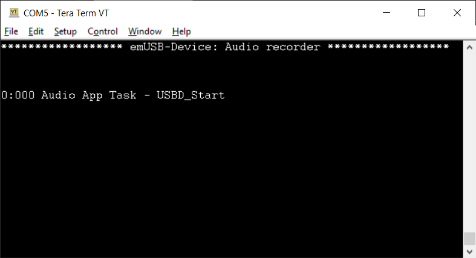
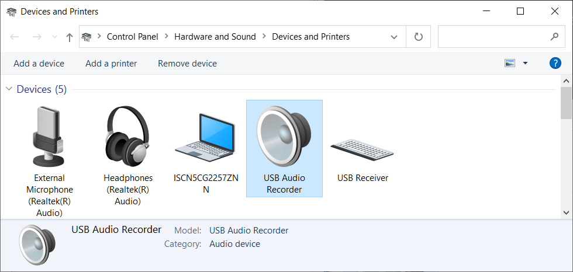
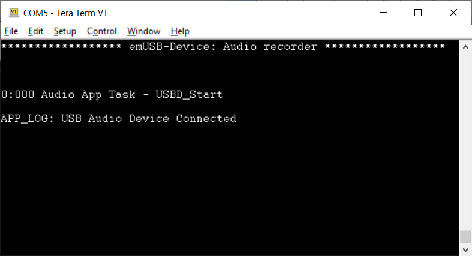
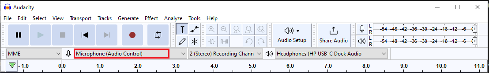
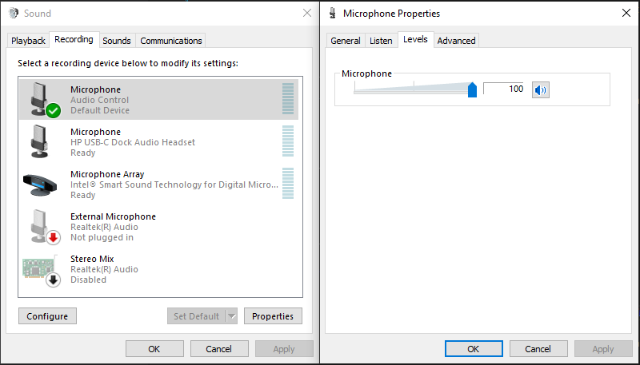
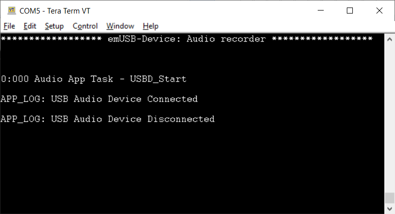

# emUSB-Device: Audio recorder

This example demonstrates how to set up the USB block of an Infineon MCU using audio class of Segger's [emUSB-Device](https://github.com/Infineon/emusb-device) middleware to implement an audio recorder. This example is currently supported on PSoC&trade; 6 MCU. 
This code example uses digital microphones with the pulse density modulation (PDM) to pulse code modulation (PCM) converter hardware block. Audio data captured by the microphones is streamed over USB to a PC using the audio device class. An audio recorder software tool, such as [Audacity](https://www.audacityteam.org/), running on a computer initiates the recording and streaming of audio data.

**Figure 1. Block diagram**



The PDM/PCM interface requires two wires - PDM Clock and PDM Data. Up to two digital PDM microphones can share the same PDM data line. One microphone samples in the falling edge and the other on the rising edge.

[View this README on GitHub.](https://github.com/Infineon/mtb-example-usb-device-audio-recorder-freertos)

[Provide feedback on this code example.](https://cypress.co1.qualtrics.com/jfe/form/SV_1NTns53sK2yiljn?Q_EED=eyJVbmlxdWUgRG9jIElkIjoiQ0UyMzY3ODUiLCJTcGVjIE51bWJlciI6IjAwMi0zNjc4NSIsIkRvYyBUaXRsZSI6ImVtVVNCLURldmljZTogQXVkaW8gcmVjb3JkZXIiLCJyaWQiOiJtYWp1bWRhciIsIkRvYyB2ZXJzaW9uIjoiMS4wLjAiLCJEb2MgTGFuZ3VhZ2UiOiJFbmdsaXNoIiwiRG9jIERpdmlzaW9uIjoiTUNEIiwiRG9jIEJVIjoiSUNXIiwiRG9jIEZhbWlseSI6IlBTT0MifQ==)


## Requirements

- [ModusToolbox&trade; software](https://www.infineon.com/modustoolbox) v3.0 or later (tested with v3.0)
- Board support package (BSP) minimum required version: 4.0.0
- Programming language: C
- Associated parts: All [PSoC&trade; 6 MCU](https://www.infineon.com/cms/en/product/microcontroller/32-bit-psoc-arm-cortex-microcontroller/psoc-6-32-bit-arm-cortex-m4-mcu/) parts


## Supported toolchains (make variable 'TOOLCHAIN')

- GNU Arm&reg; embedded compiler v10.3.1 (`GCC_ARM`) - Default value of `TOOLCHAIN`
- Arm&reg; compiler v6.16 (`ARM`)
- IAR C/C++ compiler v9.30.1 (`IAR`)


## Supported kits (make variable 'TARGET')

- [PSoC&trade; 6 Wi-Fi Bluetooth&reg; prototyping kit](https://www.infineon.com/CY8CPROTO-062-4343W) (`CY8CPROTO-062-4343W`) – Default value of `TARGET`
- [PSoC&trade; 6 Wi-Fi Bluetooth&reg; pioneer kit](https://www.infineon.com/CY8CKIT-062-WiFi-BT) (`CY8CKIT-062-WIFI-BT`)
- [PSoC&trade; 62S2 Wi-Fi Bluetooth&reg; pioneer kit](https://www.infineon.com/CY8CKIT-062S2-43012) (`CY8CKIT-062S2-43012`)
- [PSoC&trade; 62S1 Wi-Fi Bluetooth&reg; pioneer kit](https://www.infineon.com/CYW9P62S1-43438EVB-01) (`CYW9P62S1-43438EVB-01`)
- [PSoC&trade; 62S1 Wi-Fi Bluetooth&reg; pioneer kit](https://www.infineon.com/CYW9P62S1-43012EVB-01) (`CYW9P62S1-43012EVB-01`)
- [PSoC&trade; 62S2 evaluation kit](https://www.infineon.com/CY8CEVAL-062S2) (`CY8CEVAL-062S2`, `CY8CEVAL-062S2-LAI-4373M2`, `CY8CEVAL-062S2-MUR-43439M2`, `CY8CEVAL-062S2-LAI-43439M2`)


## Hardware setup

This code example requires a PDM microphone. If using an Arduino compatible kit, you can use the [TFT display shield board CY8CKIT-028-TFT](https://www.infineon.com/cms/en/product/evaluation-boards/cy8ckit-028-tft/), which has a PDM microphone. This shield comes with CY8CKIT-062-WIFI-BT. It can also be purchased standalone and be used with other supported kits listed.

**Note:** The PSoC&trade; 6 Bluetooth&reg; LE pioneer kit (CY8CKIT-062-BLE) and the PSoC&trade; 6 Wi-Fi Bluetooth&reg; pioneer kit (CY8CKIT-062-WIFI-BT) ship with KitProg2 installed. The ModusToolbox&trade; software requires KitProg3. Before using this code example, make sure that the board is upgraded to KitProg3. The tool and instructions are available in the [Firmware Loader](https://github.com/Infineon/Firmware-loader) GitHub repository. If you do not upgrade, you will see an error like "unable to find CMSIS-DAP device" or "KitProg firmware is out of date".


## Software setup

Install a terminal emulator if you don't have one. Instructions in this document use [Tera Term](https://ttssh2.osdn.jp/index.html.en).

This example uses the [Audacity](https://www.audacityteam.org/) tool to stream the audio recording from Infineon MCU detected as microphone. You can also use any other software tool that is able to stream audio data.


## Using the code example

Create the project and open it using one of the following:

<details><summary><b>In Eclipse IDE for ModusToolbox&trade; software</b></summary>

1. Click the **New Application** link in the **Quick Panel** (or, use **File** > **New** > **ModusToolbox&trade; Application**). This launches the [Project Creator](https://www.infineon.com/ModusToolboxProjectCreator) tool.

2. Pick a kit supported by the code example from the list shown in the **Project Creator - Choose Board Support Package (BSP)** dialog.
   When you select a supported kit, the example is reconfigured automatically to work with the kit. To work with a different supported kit later, use the [Library Manager](https://www.infineon.com/ModusToolboxLibraryManager) to choose the BSP for the supported kit. You can use the Library Manager to select or update the BSP and firmware libraries used in this application. To access the Library Manager, click the link from the **Quick Panel**.

   You can also just start the application creation process again and select a different kit.

   If you want to use the application for a kit not listed here, you may need to update the source files. If the kit does not have the required resources, the application may not work.

3. In the **Project Creator - Select Application** dialog, choose the example by enabling the checkbox.

4. (Optional) Change the suggested **New Application Name**.

5. The **Application(s) Root Path** defaults to the Eclipse workspace which is usually the desired location for the application. If you want to store the application in a different location, you can change the *Application(s) Root Path* value. Applications that share libraries should be in the same root path.

6. Click **Create** to complete the application creation process.

For more details, see the [Eclipse IDE for ModusToolbox&trade; software user guide](https://www.infineon.com/MTBEclipseIDEUserGuide) (locally available at *{ModusToolbox&trade; software install directory}/docs_{version}/mt_ide_user_guide.pdf*).

</details>
<details><summary><b>In command-line interface (CLI)</b></summary>

ModusToolbox&trade; software provides the Project Creator as both a GUI tool and the command line tool, "project-creator-cli". The CLI tool can be used to create applications from a CLI terminal or from within batch files or shell scripts. This tool is available in the *{ModusToolbox&trade; software install directory}/tools_{version}/project-creator/* directory.

Use a CLI terminal to invoke the "project-creator-cli" tool. On Windows, use the command line "modus-shell" program provided in the ModusToolbox&trade; software installation instead of a standard Windows command-line application. This shell provides access to all ModusToolbox&trade; software tools. You can access it by typing `modus-shell` in the search box in the Windows menu. In Linux and macOS, you can use any terminal application.

The "project-creator-cli" tool has the following arguments:

Argument | Description | Required/optional
---------|-------------|-----------
`--board-id` | Defined in the `<id>` field of the [BSP](https://github.com/Infineon?q=bsp-manifest&type=&language=&sort=) manifest | Required
`--app-id`   | Defined in the `<id>` field of the [CE](https://github.com/Infineon?q=ce-manifest&type=&language=&sort=) manifest | Required
`--target-dir`| Specify the directory in which the application is to be created if you prefer not to use the default current working directory | Optional
`--user-app-name`| Specify the name of the application if you prefer to have a name other than the example's default name | Optional

<br />
The following example clones the "[mtb-example-usb-device-audio-recorder-freertos](https://github.com/Infineon/mtb-example-usb-device-audio-recorder-freertos)" application with the desired name "USB-Audio-Recorder" configured for the *CY8CPROTO-062-4343W* BSP into the specified working directory, *C:/mtb_projects*:

   ```
   project-creator-cli --board-id CY8CPROTO-062-4343W --app-id mtb-example-usb-device-audio-recorder-freertos --user-app-name USB-Audio-Recorder --target-dir "C:/mtb_projects"
   ```

**Note:** The project-creator-cli tool uses the `git clone` and `make getlibs` commands to fetch the repository and import the required libraries. For details, see the "Project creator tools" section of the [ModusToolbox&trade; software user guide](https://www.infineon.com/ModusToolboxUserGuide) (locally available at *{ModusToolbox&trade; software install directory}/docs_{version}/mtb_user_guide.pdf*).

To work with a different supported kit later, use the [Library Manager](https://www.infineon.com/ModusToolboxLibraryManager) to choose the BSP for the supported kit. You can invoke the Library Manager GUI tool from the terminal using `make library-manager` command or use the Library Manager CLI tool "library-manager-cli" to change the BSP.

The "library-manager-cli" tool has the following arguments:

Argument | Description | Required/optional
---------|-------------|-----------
`--add-bsp-name` | Name of the BSP that should be added to the application | Required
`--set-active-bsp` | Name of the BSP that should be as active BSP for the application | Required
`--add-bsp-version`| Specify the version of the BSP that should be added to the application if you do not wish to use the latest from manifest | Optional
`--add-bsp-location`| Specify the location of the BSP (local/shared) if you prefer to add the BSP in a shared path | Optional

<br />
The following example adds the CY8CPROTO-062-4343W BSP to the already created application and makes it the active BSP for the app:

   ```
   library-manager-cli --project "C:/mtb_projects/USB-Audio-Recorder" --add-bsp-name CY8CPROTO-062-4343W --add-bsp-version "latest-v4.X" --add-bsp-location "local"

   library-manager-cli --project "C:/mtb_projects/USB-Audio-Recorder" --set-active-bsp APP_CY8CPROTO-062-4343W
   ```

</details>

<details><summary><b>In third-party IDEs</b></summary>

Use one of the following options:

- **Use the standalone [Project Creator](https://www.infineon.com/ModusToolboxProjectCreator) tool:**

   1. Launch Project Creator from the Windows Start menu or from *{ModusToolbox&trade; software install directory}/tools_{version}/project-creator/project-creator.exe*.

   2. In the initial **Choose Board Support Package** screen, select the BSP, and click **Next**.

   3. In the **Select Application** screen, select the appropriate IDE from the **Target IDE** drop-down menu.

   4. Click **Create** and follow the instructions printed in the bottom pane to import or open the exported project in the respective IDE.

<br>

- **Use command-line interface (CLI):**

   1. Follow the instructions from the **In command-line interface (CLI)** section to create the application.

   2. Export the application to a supported IDE using the `make <ide>` command.

   3. Follow the instructions displayed in the terminal to create or import the application as an IDE project.

For a list of supported IDEs and more details, see the "Exporting to IDEs" section of the [ModusToolbox&trade; software user guide](https://www.infineon.com/ModusToolboxUserGuide) (locally available at *{ModusToolbox&trade; software install directory}/docs_{version}/mtb_user_guide.pdf*).

</details>

**Note:** Initially, the customized configuration files such as *design.cyqspi*, *design.cycapsense*, and *design.modus* are present in the *templates/TARGET_< BSP-NAME >/config* folder and are copied automatically from this folder to *bsps/TARGET_< BSP-NAME >/config* during library updates. The build system reads all these configurations from the *bsps/TARGET_< BSP-NAME >/config* folder.


## Operation

1. Connect the board to your Windows PC using the provided USB cable through the KitProg3 USB connector.

2. Open a terminal program and select the KitProg3 COM port. Set the serial port parameters to 8N1 and 115200 baud.

3. Program the board using one of the following:

   <details><summary><b>Using Eclipse IDE for ModusToolbox&trade; software</b></summary>

      1. Select the application project in the Project Explorer.

      2. In the **Quick Panel**, scroll down, and click **\<Application Name> Program (KitProg3_MiniProg4)**.
   </details>

   <details><summary><b>Using CLI</b></summary>

     From the terminal, execute the `make program` command to build and program the application using the default toolchain to the default target. The default toolchain is specified in the application's Makefile but you can override this value manually:
      ```
      make program TOOLCHAIN=<toolchain>
      ```

      Example:
      ```
      make program TOOLCHAIN=GCC_ARM
      ```
   </details>

4. After programming, the application starts automatically. Confirm that the title of the code example is displayed on the serial terminal and the kit user LED keeps blinking untill the USB cable is plugged to the USB device connector:

   **Figure 2. USB audio device startup**

   

5. Connect another USB cable to the USB device connector (see the kit user guide for its location). If using the CY8CKIT-062-WIFI-BT or any other Arduino compatible kit, ensure the TFT shield is connected to the main board.

6. On the Windows computer, verify that a new USB device is enumerated as a microphone and named as "USB audio recorder". 

   **Figure 3. USB audio device enumeration**

   

7. Note that the kit user LED is turned OFF and a USB audio device connected status is displayed on the serial terminal as shown in **Figure 4**.

   **Figure 4. USB audio device connected**

   

8. Open an audio recorder software tool in the computer. If you do not have one, download the open-source software [Audacity](https://www.audacityteam.org/). Make sure to select the correct microphone in the audio recorder tool as shown in **Figure 5**.

   

9. Start a recording session in the audio recorder software and play a sound, or speak over the microphone in the kit. Subsequently the kit user LED is turned ON indicating that the device has started recording.

10. To exercise the microphone's mute control, open the **Control Panel** from Windows Start menu and double-click on the **Sound** menu in it. In the **Sound** window navigate to the **Recording** tab and select the detected **Microphone (Audio Control)**.
11. Double-click the selected **Microphone (Audio Control)** to open its properties. In the **Microphone Properties** window, toggle the **Mute**  button under the **Levels** tab to mute/unmute the microphone.

      **Figure 5. USB audio device mute**

      

12. Stop the recording session and play it to confirm that the audio was recorded correctly. Also observe that the kit user LED is turned OFF indicating the end of recording session.

13. Once the USB cable gets disconnected from the USB device, USB audio device disconnected status is displayed on the serial terminal as shown in **Figure 6**.

      **Figure 6. USB audio device disconnected**

      


## Debugging

You can debug the example to step through the code. In the IDE, use the **\<Application Name> Debug (KitProg3_MiniProg4)** configuration in the **Quick Panel**. For details, see the "Program and debug" section in the [Eclipse IDE for ModusToolbox&trade; software user guide](https://www.infineon.com/MTBEclipseIDEUserGuide).

**Note:** **(Only while debugging)** On the CM4 CPU, some code in `main()` may execute before the debugger halts at the beginning of `main()`. This means that some code executes twice – once before the debugger stops execution, and again after the debugger resets the program counter to the beginning of `main()`. See [KBA231071](https://community.infineon.com/docs/DOC-21143) to learn about this and for the workaround.


## Design and implementation

The PDM/PCM hardware block can sample one or two PDM digital microphones. In this application, the hardware block is configured to sample stereo audio at 44.1 ksps (default) with 16-bits resolution. The sample audio data is eventually transferred to the USB data endpoint buffer. 

**Note:** 

1. This example can support audio sampling rate up to 44.1 ksps on PSoC&trade; 6. Because when the USB host and PSoC&trade; 6 audio subsystem are out of sync, the PDM/PCM block may generate variable number of bytes (196/188) at every 1 ms to be sent to the USB host. If all the bytes are not sent, the PDM/PCM FIFO will eventually overflow or underflow, causing disruption in the audio streaming to the USB host. Since the ISO transfer is limited to 192-bytes in the  PSoC&trade; 6 driver, variable number of bytes generated by the audio subsystem cannot be transferred at audio sample rate >= 48ksps with 16-bits resolution.
2. The user can change the value of the AUDIO_IN_SAMPLE_FREQ declared in *include/audio.h* to change the sample rate between 16 ksps to 44.1 ksps.
3. The USB descriptor implements the audio device class with one endpoint:
   - **Audio IN Endpoint:** sends the data to the USB host
      - To view the USB device descriptor and the logical volume info, see the *source/cycfg_emusbdev.c* file.

The firmware consists of a main() function which creates an "Audio App Task". This task invokes add_audio() function to add the audio interface to USB stack. It configures the device descriptor for enumeration using USBD_SetDeviceInfo() API. Once the configuration is done, "Audio App Task" calls audio_in_init() function to initialize the PDM PCM block. At the end it creates the "Audio In Task" and calls the target API USBD_Start() to start the USB stack. This task keeps track of the USB connection/disconnection events by monitoring the suspend and resume conditions on the bus.

"Audio In Task" handles operations of the microphone interface using USBD_AUDIO_Write_Task() function. 
audio_in_endpoint_callback() is called in context of USBD_AUDIO_Write_Task() to handle audio data transfer to the host (IN direction). audio_control_callback() handles audio class control commands coming from the host. Both of these callbacks are registered when the Audio interface is added to the USB stack using add_audio() function.

### Resources and settings

**Table 1. Application resources** 

| Resource  |  Alias/object     |    Purpose     |
| :------- | :------------    | :------------ |
| USBDEV (HAL) | CYBSP_EMUSB_DEV  | USB device block configured with audio descriptor |
| UART (HAL)   | CYBSP_DEBUG_UART_TX, CYBSP_DEBUG_UART_RX | UART TX and RX pins used by Retarget-IO for printing on the console |
| GPIO (HAL)    | CYBSP_USER_LED | User LED is turned ON when audio is recorded |
| PDM/PCM (HAL) | pdm_pcm | Interfaces with the microphone |

<br>

## Related resources

Resources  | Links
-----------|----------------------------------
Application notes  | [AN228571](https://www.infineon.com/dgdl/Infineon-AN228571_Getting_started_with_PSoC_6_MCU_on_ModusToolbox_software-ApplicationNotes-v06_00-EN.pdf?fileId=8ac78c8c7cdc391c017d0d36de1f66d1) – Getting started with PSoC&trade; 6 MCU on ModusToolbox&trade; software <br />  [AN215656](https://www.infineon.com/dgdl/Infineon-AN215656_PSoC_6_MCU_Dual-CPU_System_Design-ApplicationNotes-v09_00-EN.pdf?fileId=8ac78c8c7cdc391c017d0d3180c4655f) – PSoC&trade; 6 MCU: Dual-CPU system design <br />
Code examples  | [Using ModusToolbox&trade; software](https://github.com/Infineon/Code-Examples-for-ModusToolbox-Software) on GitHub
Device documentation | [PSoC&trade; 6 MCU datasheets](https://www.infineon.com/cms/en/search.html#!view=downloads&term=PSoC%206&doc_group=Data%20Sheet) <br> [PSoC&trade; 6 technical reference manuals](https://www.infineon.com/cms/en/search.html#!view=downloads&term=PSoC%206&doc_group=Additional%20Technical%20Information)
Development kits |  Visit [Evaluation Board Finder](https://www.infineon.com/cms/en/design-support/finder-selection-tools/product-finder/evaluation-board/?utm_source=infineon&utm_medium=referral&utm_campaign=202110_globe_en_all_integration-store) and use the **Options** section to filter kits by *Product family*.
Libraries on GitHub  | [mtb-pdl-cat1](https://github.com/Infineon/mtb-pdl-cat1) – Peripheral driver library (PDL)  <br> [mtb-hal-cat1](https://github.com/Infineon/mtb-hal-cat1) – Hardware abstraction layer (HAL) library <br> [retarget-io](https://github.com/Infineon/retarget-io) – Utility library to retarget STDIO messages to a UART port
Middleware on GitHub  | [emUSB-Device](https://github.com/Infineon/emusb-device) – emUSB-Device <br> [emUSB-Device API reference](https://infineon.github.io/emusb-device/html/index.html) – emUSB-Device API Reference <br> [psoc6-middleware](https://github.com/Infineon/modustoolbox-software#psoc-6-middleware-libraries) – Links to all PSoC&trade; 6 MCU middleware
Tools  | [Eclipse IDE for ModusToolbox&trade; software](https://www.infineon.com/cms/en/design-support/tools/sdk/modustoolbox-software/) – ModusToolbox&trade; software is a collection of easy-to-use software and tools enabling rapid development with Infineon MCUs, covering applications from embedded sense and control to wireless and cloud-connected systems using AIROC&trade; Wi-Fi and Bluetooth® connectivity devices.
<br>


## Other resources

Infineon provides a wealth of data at [www.infineon.com](https://www.infineon.com/) to help you select the right device, and quickly and effectively integrate it into your design.

For PSoC&trade; 6 MCU devices, see [How to design with PSoC&trade; 6 MCU – KBA223067](https://community.infineon.com/docs/DOC-14644) in the Infineon Developer community.


## Document history

Document title: *CE236785* - *emUSB-Device: Audio recorder*

| Version | Description of change |
| ------- | --------------------- |
| 1.0.0   | New code example      |
------
<br />


© Cypress Semiconductor Corporation, 2023. This document is the property of Cypress Semiconductor Corporation, an Infineon Technologies company, and its affiliates ("Cypress").  This document, including any software or firmware included or referenced in this document ("Software"), is owned by Cypress under the intellectual property laws and treaties of the United States and other countries worldwide.  Cypress reserves all rights under such laws and treaties and does not, except as specifically stated in this paragraph, grant any license under its patents, copyrights, trademarks, or other intellectual property rights.  If the Software is not accompanied by a license agreement and you do not otherwise have a written agreement with Cypress governing the use of the Software, then Cypress hereby grants you a personal, non-exclusive, nontransferable license (without the right to sublicense) (1) under its copyright rights in the Software (a) for Software provided in source code form, to modify and reproduce the Software solely for use with Cypress hardware products, only internally within your organization, and (b) to distribute the Software in binary code form externally to end users (either directly or indirectly through resellers and distributors), solely for use on Cypress hardware product units, and (2) under those claims of Cypress’s patents that are infringed by the Software (as provided by Cypress, unmodified) to make, use, distribute, and import the Software solely for use with Cypress hardware products.  Any other use, reproduction, modification, translation, or compilation of the Software is prohibited.
<br />
TO THE EXTENT PERMITTED BY APPLICABLE LAW, CYPRESS MAKES NO WARRANTY OF ANY KIND, EXPRESS OR IMPLIED, WITH REGARD TO THIS DOCUMENT OR ANY SOFTWARE OR ACCOMPANYING HARDWARE, INCLUDING, BUT NOT LIMITED TO, THE IMPLIED WARRANTIES OF MERCHANTABILITY AND FITNESS FOR A PARTICULAR PURPOSE.  No computing device can be absolutely secure.  Therefore, despite security measures implemented in Cypress hardware or software products, Cypress shall have no liability arising out of any security breach, such as unauthorized access to or use of a Cypress product. CYPRESS DOES NOT REPRESENT, WARRANT, OR GUARANTEE THAT CYPRESS PRODUCTS, OR SYSTEMS CREATED USING CYPRESS PRODUCTS, WILL BE FREE FROM CORRUPTION, ATTACK, VIRUSES, INTERFERENCE, HACKING, DATA LOSS OR THEFT, OR OTHER SECURITY INTRUSION (collectively, "Security Breach").  Cypress disclaims any liability relating to any Security Breach, and you shall and hereby do release Cypress from any claim, damage, or other liability arising from any Security Breach.  In addition, the products described in these materials may contain design defects or errors known as errata which may cause the product to deviate from published specifications. To the extent permitted by applicable law, Cypress reserves the right to make changes to this document without further notice. Cypress does not assume any liability arising out of the application or use of any product or circuit described in this document. Any information provided in this document, including any sample design information or programming code, is provided only for reference purposes.  It is the responsibility of the user of this document to properly design, program, and test the functionality and safety of any application made of this information and any resulting product.  "High-Risk Device" means any device or system whose failure could cause personal injury, death, or property damage.  Examples of High-Risk Devices are weapons, nuclear installations, surgical implants, and other medical devices.  "Critical Component" means any component of a High-Risk Device whose failure to perform can be reasonably expected to cause, directly or indirectly, the failure of the High-Risk Device, or to affect its safety or effectiveness.  Cypress is not liable, in whole or in part, and you shall and hereby do release Cypress from any claim, damage, or other liability arising from any use of a Cypress product as a Critical Component in a High-Risk Device. You shall indemnify and hold Cypress, including its affiliates, and its directors, officers, employees, agents, distributors, and assigns harmless from and against all claims, costs, damages, and expenses, arising out of any claim, including claims for product liability, personal injury or death, or property damage arising from any use of a Cypress product as a Critical Component in a High-Risk Device. Cypress products are not intended or authorized for use as a Critical Component in any High-Risk Device except to the limited extent that (i) Cypress’s published data sheet for the product explicitly states Cypress has qualified the product for use in a specific High-Risk Device, or (ii) Cypress has given you advance written authorization to use the product as a Critical Component in the specific High-Risk Device and you have signed a separate indemnification agreement.
<br />
Cypress, the Cypress logo, and combinations thereof, WICED, ModusToolbox, PSoC, CapSense, EZ-USB, F-RAM, and Traveo are trademarks or registered trademarks of Cypress or a subsidiary of Cypress in the United States or in other countries. For a more complete list of Cypress trademarks, visit www.infineon.com. Other names and brands may be claimed as property of their respective owners.
